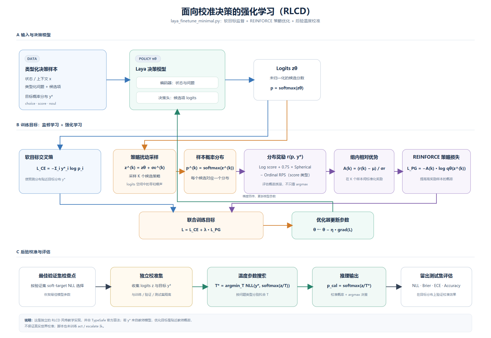
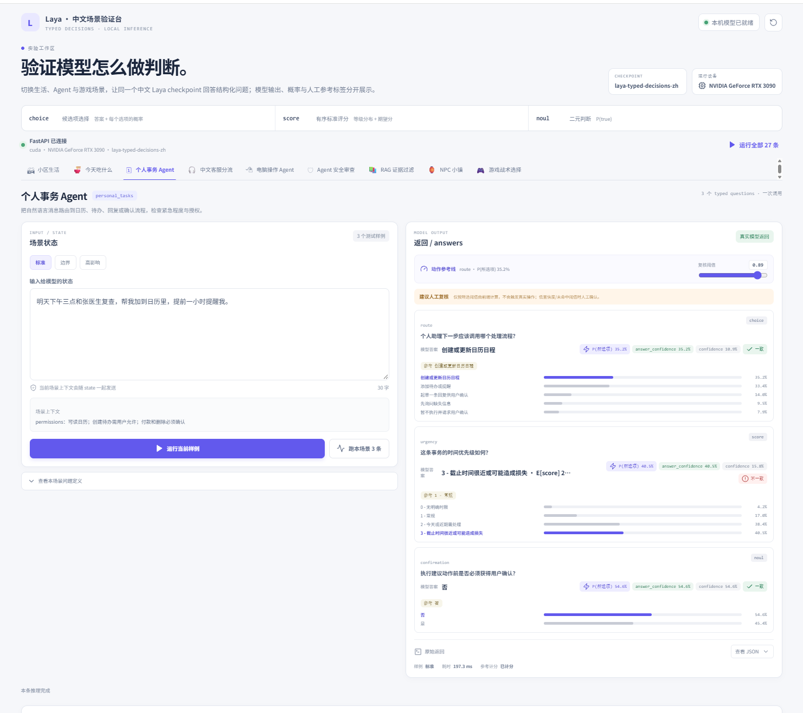

# Chinese Laya: Typed Decisions 微调实验

本仓库记录一个基于 Laya multilingual 的中文化 typed-decisions 微调实验：将公开英文决策数据中的指定自然语言字段翻译成简体中文，保留原始结构和软目标分布，再微调 Laya 的 encoder 与决策头，并在独立校准集和测试集上评估。

这是个人实验与工程复现记录，不是 Laya 官方训练器、官方中文模型或官方 benchmark。结果说明模型对这份机器翻译基准的拟合变化，不代表真实中文业务正确率。

## 文档与结果入口

- 技术评估报告：[reports/laya-zh-finetune-evaluation.html](reports/laya-zh-finetune-evaluation.html)
- 公众号排版版本：[reports/laya-zh-finetune-wechat.html](reports/laya-zh-finetune-wechat.html)
- Laya 技术拆解与微调实战：[docs/Laya 技术拆解与微调实战.md](docs/Laya%20技术拆解与微调实战.md)
- Demo 使用说明：[demo-app/README.md](demo-app/README.md)
- 数据切分清单：[datasets/all_zh/manifest.json](datasets/all_zh/manifest.json)
- 原始 multilingual 基线与本地 4 轮复测：[reports/laya-multilingual-baseline.json](reports/laya-multilingual-baseline.json)

## 核心结果

原始 multilingual、4 轮微调和 10 轮训练计划的最佳检查点都在同一份 2,000 题中文测试集上比较。10 轮计划最终选择第 7 轮权重，因为它在验证集上的 Soft-target NLL 最低。

| 检查点 | 测试目标类别一致率 | Soft-target NLL ↓ | 平方误差 / Brier ↓ | ECE ↓* | Score 期望值 MAE ↓ |
| --- | ---: | ---: | ---: | ---: | ---: |
| 原始 multilingual（校准后） | 34.05% | 1.2374 | 0.26162 | 0.0764 | 0.7172 |
| 微调 4 轮 | 74.95% | 0.8838 | 0.06355 | 0.1592 | 0.2662 |
| 微调 10 轮计划，最佳为 E7 | 76.25% | 0.8706 | 0.05702 | 0.1502 | 0.2358 |

相较原始 multilingual，10 轮计划的最佳检查点在 2,000 个问题中多匹配 844 题，目标类别一致率提高 42.20 个百分点。相较 4 轮结果，提升为 1.30 个百分点，即多匹配 26 题。

这些数字需要连同评估定义和限制一起阅读：

- “准确率”是预测概率最高的类别是否等于数据集软目标概率最高的类别。它不是人工复核后的业务准确率。
- 表中的概率指标在独立的 600 题校准集上按问题类型拟合温度后计算。温度缩放不改变类别排序，因此不改变上述准确率。
- *ECE 是按预测最大概率分 15 个等宽桶，再对比置信度和目标类别命中率计算的误差。本项目中 ECE 从校准后基线的 0.0764 上升到微调后的约 0.15，不能据此声称所有指标都改善。
- 测试题来自 400 个案例，每个案例包含多个相关问题；2,000 题不是 2,000 个完全独立的样本。
- 当前结果来自一次训练，没有多随机种子重复、置信区间或显著性检验。
- 中文字段由 Ternary-Bonsai-2-27B 机器翻译生成，原始标签和目标概率保留；它们不是独立的人类中文金标准。

10 轮计划中，E7 的验证集 Soft-target NLL 为 0.8515。10 轮配置从原始底座重新开始训练，并非在 4 轮检查点上继续训练 6 轮。改变总轮数也改变了余弦学习率与噪声衰减日程，所以 4 轮与 10 轮不是只改变一个变量的严格消融实验。

### 未校准原始底座结果

原始 multilingual 使用默认温度 T=1 时，测试集结果为：

| 指标 | 原始 multilingual，T=1 |
| --- | ---: |
| 目标类别一致率 | 34.05% |
| Soft-target NLL | 1.8873 |
| 平方误差 / Brier | 0.48002 |
| ECE | 0.3290 |
| Score 期望值 MAE | 0.8026 |

原始底座在校准集上拟合出的三个类型温度都是 T=5.0，达到了搜索范围上限。因此校准后的基线概率分数不应被解释为充分校准；后续应扩大温度搜索并使用独立的人工复核数据验证。

## 模型与训练方法

### 输入和输出

模型基于 Laya multilingual 检查点，使用 mmBERT-base encoder 和 Laya typed-decision head。它读取一个 state 和一个或多个 typed questions，输出候选项上的概率分布，不通过自回归逐 token 生成一段答案。

问题分为三种类型：

- **choice**：在有序候选项中选择，候选项顺序按 criteria 对象的 JSON 插入顺序。
- **score**：在有序等级中打分，等级顺序按 criteria 数组。
- **noul**：真假二分类，类别顺序固定为 false、true。

训练脚本通过 Laya 的 build_sequence 生成输入，再读取候选项标记位置上的 logits。原始 gold.probabilities 被规范化成软目标分布；choice、score、noul 共用同一批次训练，但分别计算类型对应的温度参数。

### 目标函数

训练损失由软目标交叉熵和 RLCD 风格的组内策略项组成：

    L = L_soft-target + rl_weight × L_policy

其中，软目标项为：

    L_soft-target = -Σᵢ qᵢ log(pᵢ)

q 是数据集目标概率分布，p 是模型预测分布。策略项对 logits 添加零和高斯扰动，为每个问题采样一组候选分布，用组内标准化后的相对优势估计策略梯度。当前实现的分布奖励包括 log score、权重为 0.75 的 spherical score；score 类型额外加入有序 Ranked Probability Score（RPS）惩罚。噪声标准差从 0.4 线性衰减到 0.1。

这是仓库训练脚本中的 RLCD 风格近似实现，不是 Laya 上游的官方训练器或完整官方 RLCD 实现。数据没有提供 Act/Escalate 监督，因此该头被冻结，不能把本实验结果用于宣称自动执行或升级处理能力。

图示仅描述本项目的实现顺序：软目标训练、RLCD 风格采样策略项、按验证集选择 checkpoint、独立校准和最终测试；不是上游算法实现的逐项复刻。

## 数据集与中文化

### 来源和工作流

源数据为 [LocalLLaMA/typed-decisions](https://huggingface.co/datasets/LocalLLaMA/typed-decisions)，包含四类合成决策工作流：

1. agent_trace_observability
2. customer_service
3. invoice_processing
4. security_incidents

数据集采用 Apache-2.0 许可证（以数据集卡当前声明为准）。数据内容、原始结构和标签含义应同时参考上游数据集卡。

### 翻译范围

label_typed_decisions_zh.py 通过 OpenAI-compatible Chat Completions API 翻译选定的自然语言内容，包括 state 中的任务、约束、客服消息、告警描述和证据、发货条件、采购订单货运条款，以及问题 instructions 和 criteria 描述。

脚本保留 JSON 字段名、案例 ID、workflow、枚举值、问题类型、候选顺序以及 gold 中的标签和概率分布。数字、URL、邮箱、IP、代码片段和特定大写 token 会先替换成占位符，翻译后再恢复。每条唯一文本只翻译一次，结果缓存在输出目录中；写文件前会检查结构、目标值、翻译覆盖和分区重复。

因此，all_zh 表示输入文本已中文化，不表示监督标签由中文标注员重新标注。

### 分区和数量

先按原始案例切分，再展开其中的问题，避免同一案例的多个问题跨分区。

| 分区 | 案例数 | 问题数 | 工作流用途 |
| --- | ---: | ---: | --- |
| Train | 960 | 4,800 | 参数更新 |
| Valid | 120 | 600 | 按 Soft-target NLL 选择最佳训练轮次 |
| Calib | 120 | 600 | 按问题类型拟合温度 |
| Test | 400 | 2,000 | 最终评估 |

原始 train 的 1,200 个案例按 workflow 分层，以固定种子 20260924 分为 80% train、10% valid、10% calib。原始 test 的 400 个案例保持独立，不参与训练、选择检查点或拟合温度。各分区的 workflow 数量均衡：train 每类 240 个案例；valid 和 calib 每类各 30 个；test 每类各 100 个。按当前数据构造，每个案例提供 5 个问题。

训练脚本启动时再次检查不同分区的 ID、group_id 和 state 内容哈希，阻止重复案例、同组案例和完全相同状态跨分区。标注脚本也会核对输入与输出案例集合相同、问题结构和 gold 未被改变。

## 评估协议和指标定义

测试前的流程为：

1. 每轮训练后，在 valid 上计算 Soft-target NLL。
2. 选择 valid Soft-target NLL 最低的检查点。
3. 重新加载该检查点，在 calib 上分别为 choice、score、noul 搜索温度。
4. 锁定检查点和温度后，在 test 上计算一次最终指标。

温度通过 256 点对数网格搜索，范围为 0.5 至 5.0，并显式包含 T=1。每种问题类型分别拟合，不在 train 或 test 上拟合。

| 指标 | 定义 |
| --- | --- |
| 目标类别一致率 | argmax(prediction) 是否等于 argmax(target distribution)，按问题平均。 |
| Soft-target NLL | 对目标分布与模型 log probability 计算交叉熵，按问题平均；衡量模型对整个目标分布的拟合。 |
| 平方误差 / Brier | 每个问题上对所有候选类别的 (p - q)² 求和，再按问题平均。 |
| ECE | 最大预测概率与目标分布最高概率类别命中值的差异，按 15 个固定置信度区间加权。它不是对完整软目标分布的 proper score。 |
| Score 期望值 MAE | 仅在 score 问题上，计算模型和目标分布在从 0 开始的有序等级上的期望值绝对误差。 |

原始 multilingual 的温度为 [5.0, 5.0, 5.0]；本地 4 轮检查点的温度为 [1.1684, 1.3500, 1.3623]。10 轮报告中的温度值以对应训练报告为准。基线温度达到搜索上限、ECE 按硬目标类别计算、测试题按案例聚类等因素，都限制了对校准结果的解释。

## 复现实验

### 目录约定

训练命令期望以下路径：

    models/laya/multilingual/       # 下载或复制好的 Laya multilingual checkpoint
    datasets/all_zh/train.jsonl
    datasets/all_zh/valid.jsonl
    datasets/all_zh/calib.jsonl
    datasets/all_zh/test.jsonl
    runs/                           # 训练输出目录

中文 JSONL 数据和翻译 manifest 已放在仓库中。模型权重及大体积训练运行目录在当前仓库设置中被忽略，不应假定它们会随 git clone 下载。训练前先确认模型目录包含 Laya 所需的配置、tokenizer 和权重文件。

### 环境准备

需要 Python 3.10 或更新版本。GPU 训练需要 NVIDIA GPU、驱动和与其匹配的 CUDA 版 PyTorch。先按照目标机器的驱动与 CUDA 环境安装合适的 PyTorch，再安装本项目使用的训练依赖：

    python -m pip install --upgrade pip
    python -m pip install transformers==5.5.0 safetensors tqdm pyarrow requests
    python -m pip install ./laya-0.3.20-py3-none-any.whl

仓库附有 Laya 0.3.20 wheel。也可在已经单独取得 Laya 源码且目录确实存在的环境中执行 python -m pip install -e ./laya，将当前源码目录以 editable 模式安装。根目录的忽略规则排除了名为 laya 的源码目录，因此该源码副本不会自动包含在仓库中；一般复现实验优先使用附带的版本化 wheel。

评估和本地 4 轮复测记录的运行版本为 PyTorch 2.13.0+cu130、Transformers 5.5.0、Laya 0.3.20。不同 CUDA、驱动或 PyTorch 构建可能需要调整 PyTorch 安装方式。RTX 3090 复测时还遇到 Transformers 与本机 tokenizers 版本元数据检查不匹配；只在该评估进程中使用了临时导入兼容处理，没有修改环境包。独立复现时应安装相互兼容的 Transformers/tokenizers 组合。

### 翻译数据

标注脚本需要 pyarrow 和 requests，以及本机可访问的 OpenAI-compatible Chat Completions 服务。默认模型名是 Ternary-Bonsai-2-27B；本项目使用的接口不需要 API key。脚本从项目 .env 读取 TYPED_DECISIONS_API_BASE_URL，但不会读取或输出其他 .env 内容。不要把真实服务地址、密钥或个人配置写入公开 README。

先将接口地址保存在本地被忽略的 .env 文件中，例如：

    TYPED_DECISIONS_API_BASE_URL=http://<your-llm-host>:8008/v1

然后在 PowerShell 中运行：

    python label_typed_decisions_zh.py --source "D:\data\typed-decisions\all" --output ".\datasets\all_zh" --model "Ternary-Bonsai-2-27B"

Linux 示例：

    python label_typed_decisions_zh.py \
      --source "/data/typed-decisions/all" \
      --output "./datasets/all_zh" \
      --model "Ternary-Bonsai-2-27B"

--source 应指向同时含有各一个 train-*.parquet 和 test-*.parquet 的目录。生成 train、valid、calib、test 四个 JSONL 文件和 manifest。默认批次大小为 4、并发 worker 数为 2；翻译会重试，失败的大批次会递归拆小。输出目录已存在 split 文件时，脚本默认停止以免覆盖；确认要重写时加 --overwrite。翻译缓存按原始文本保存，如果更换模型或提示词，应使用新的输出目录，避免复用旧缓存。

若接口要求身份验证，可在启动进程前通过环境变量设置 TYPED_DECISIONS_API_KEY。本项目当前使用的本地接口不需要此项；密钥不要提交到版本库。

### 单 GPU 微调

scripts/train.sh 提供 4 轮配置示例。以下命令展示 Linux 服务器上的单卡运行方式，假设要使用服务器上的第 4 张 GPU：

    CUDA_VISIBLE_DEVICES=3 python laya_finetune_minimal.py \
      --model ./models/laya/multilingual \
      --train ./datasets/all_zh/train.jsonl \
      --valid ./datasets/all_zh/valid.jsonl \
      --calib ./datasets/all_zh/calib.jsonl \
      --test ./datasets/all_zh/test.jsonl \
      --out ./runs/laya-typed-decisions-zh \
      --epochs 4 \
      --batch-size 2 \
      --grad-accum 8 \
      --max-len 1024 \
      --head-max-len 256 \
      --lr-encoder 2.5e-5 \
      --lr-head 1e-4 \
      --rl-weight 1.0 \
      --device cuda

PowerShell 中可在同一窗口先选择设备：

    $env:CUDA_VISIBLE_DEVICES = "0"
    python .\laya_finetune_minimal.py --model .\models\laya\multilingual --train .\datasets\all_zh\train.jsonl --valid .\datasets\all_zh\valid.jsonl --calib .\datasets\all_zh\calib.jsonl --test .\datasets\all_zh\test.jsonl --out .\runs\laya-typed-decisions-zh --epochs 4 --batch-size 2 --grad-accum 8 --max-len 1024 --head-max-len 256 --lr-encoder 2.5e-5 --lr-head 1e-4 --rl-weight 1.0 --device cuda

10 轮方案使用相同底座和训练数据，将 --epochs 4 改为 --epochs 10。4 轮和 10 轮是两个独立实验。输出目录若已存在，脚本不会覆盖：它会自动尝试 -v2、-v3 等新版本名。以启动日志中打印出的实际输出目录为准。

当前实验的关键训练参数：

| 参数 | 设置 |
| --- | --- |
| 训练设备 | 8 张 A800 服务器中的单张 A800 80 GB；脚本为单 GPU，不使用 DDP。 |
| 训练轮数 | 分别运行 4 轮和 10 轮；10 轮计划按 valid NLL 选择 E7。 |
| Micro-batch | 2 个问题序列。 |
| 梯度累积 | 8 步；有效批次约 16 个问题序列。 |
| 输入长度 | max_len=1024、head_max_len=256。 |
| 学习率 | encoder 2.5e-5，decision head 1e-4。 |
| 优化器 | AdamW，weight decay 0.01；余弦学习率调度；梯度范数裁剪为 1.0。 |
| 精度 | CUDA 上使用 FP16 autocast 和 GradScaler。 |
| 随机种子 | 42。 |
| 检查点策略 | 每轮结束计算 valid 指标，仅按 Soft-target NLL 保存最佳权重。 |

训练日志同时输出时间戳记录与 tqdm 进度条；默认写入训练输出目录的 training.log。输出目录还包括 model.safetensors、rl_agent_config.json、encoder 配置、tokenizer 和 training_report.json。校准完成后，checkpoint 配置中保存了拟合的温度。

### 运行报告中的数字来自哪里

- 原始 multilingual 基线与 4 轮 checkpoint 在 RTX 3090 上用相同数据切分和推理环境复测；4 轮结果与训练记录相符。详细原始值见 reports/laya-multilingual-baseline.json。
- 10 轮指标取服务器上的评估记录：最佳 valid checkpoint 为 E7，最终测试 1,525/2,000 个目标类别命中。应一并归档该运行的 training_report.json、训练日志、checkpoint 文件及校准温度；当前 README 仓库记录了这些评估数值，但不能替代未随仓库提交的服务器权重和完整运行产物。
- 基线、4 轮和 10 轮概率指标均使用各自校准集拟合的温度。测试集只用于最终打分，不用于选择温度或训练轮次。
- 当前仓库没有单独的纯评估 CLI：训练脚本会在训练完成后用 best checkpoint 执行校准和测试；原始底座基线是独立评估记录，数值归档在 baseline JSON 和技术报告中。

## 推理示例

检查点目录包含微调权重和 Laya 配置后，可直接调用 Laya SDK。state 和 questions 的结构可参考 [中文 typed-decisions 样例](examples/typed-decisions-sample-zh.json)。

    import laya

    agent = laya.load("./runs/laya-typed-decisions-zh", device="cuda")

    state = {
        "task": "轮换预发布环境负载均衡器上已过期的 TLS 证书。",
        "constraints": ["变更须遵守审批流程"]
    }
    questions = {
        "risk": {
            "type": "score",
            "instructions": "这项操作的风险有多高？",
            "criteria": ["0 - 低", "1 - 中", "2 - 高"]
        },
        "needs_review": {
            "type": "noul",
            "instructions": "此操作是否需要人工复核？"
        }
    }

    result = agent.predict(state, questions, lang="zh")
    print(result["answers"])

实际返回结构以当前 Laya SDK 版本为准。样例中的风险文字只演示调用格式，不是经过校准的人类业务策略。

## 中文场景 Demo

demo-app/ 包含本地 React + Vite 前端和 FastAPI 推理服务。前端提供 9 个场景、27 条参考样例，覆盖生活与服务、Agent 与安全、知识与互动。后端加载本地 checkpoint，在单个请求锁内调用 agent.predict；推理请求发往本机服务，不会转发到外部模型 API。参考标签仅在前端用于展示对照，不会作为模型输入。页面阈值只生成“建议复核”提示，不触发外部动作。

先确保 Python base 环境中已安装 Laya、PyTorch、FastAPI、Uvicorn 和 Pydantic，Node.js/npm 可用，然后在两个终端从仓库根目录分别启动：

    # 终端 1：后端
    ./demo-app/start-backend.sh

    # 终端 2：前端
    ./demo-app/start-frontend.sh

浏览器打开 http://127.0.0.1:5173。后端 API 文档在 http://127.0.0.1:18000/docs，健康检查在 http://127.0.0.1:18000/api/health。Windows PowerShell 对应脚本为 demo-app/start-backend.ps1 和 demo-app/start-frontend.ps1。首次运行前端时，启动脚本会执行 npm ci。

后端默认加载 4 轮目录 runs/laya-typed-decisions-zh。切换 10 轮 checkpoint 时，在启动后端前指定 MODEL_PATH：

    MODEL_PATH=/absolute/path/to/laya-typed-decisions-zh-v2 ./demo-app/start-backend.sh

PowerShell 示例：

    $env:MODEL_PATH = "D:\models\laya-typed-decisions-zh-v2"
    .\demo-app\start-backend.ps1

前端截图当前展示的是 4 轮 checkpoint，不是 10 轮 E7。若需在演示中对应报告中的 10 轮指标，应确认服务器 checkpoint 已复制到 Demo 机器并设置正确的 MODEL_PATH。

截图为个人事务 Agent 场景的一次交互，不是 benchmark 测试结果。

更多启动要求、离线环境设置和故障排查见 [demo-app/README.md](demo-app/README.md)。

## 目录结构

    .
    ├── README.md
    ├── label_typed_decisions_zh.py        # API 翻译、校验和 JSONL 分区
    ├── laya_finetune_minimal.py           # typed-decision 微调、校准与测试
    ├── scripts/train.sh                   # 4 轮 Linux 训练命令
    ├── datasets/all_zh/                   # 中文 train/valid/calib/test 与 manifest
    ├── models/laya/multilingual/          # 本地预训练底座，需自行准备
    ├── runs/                              # checkpoint、日志和训练报告，需自行保管
    ├── examples/                          # 英文/中文样例与 playground
    ├── demo-app/                          # 本地 React + FastAPI Demo
    ├── reports/                           # HTML 报告与基线 JSON
    ├── docs/                              # 原理拆解与微调实战笔记
    └── assets/                            # 报告和 Demo 使用的图像

## 已知限制与后续评估

1. **中文质量尚未由专家审核。** 对所有四类 workflow 抽样复核术语、否定关系、金额、权限和安全语句；构建至少一份由中文标注员独立标注的测试集。
2. **目标来自原始英文基准。** 翻译输入而保留英文数据集的目标分布，测试提升可能同时包含语言适配、模板适配和数据模式学习，不等于开放域中文泛化。
3. **目前只有一次训练。** 对相同数据切分运行多个随机种子，报告均值、标准差或按案例 bootstrap 的置信区间。
4. **缺少分组指标。** 下一步应报告 workflow × question type 的 accuracy、NLL、Brier、ECE、混淆矩阵和样本数。
5. **校准不能只看 ECE。** 原始基线温度达到搜索上限；扩大校准集和温度范围，并同时分析可靠性图、NLL、Brier 和实际决策代价。
6. **Act/Escalate 头未训练。** 当前 checkpoint 不应被用作自动执行、付款、删改数据或安全升级策略。
7. **Demo 样本不构成业务验证。** 27 条前端参考样例仅用于交互检查；它们不等同于 2,000 题测试集，也不能替代真实线上结果。
8. **4 轮与 10 轮不是严格受控的单变量比较。** 两者训练日程不同；未来需要固定总更新数或对齐学习率、噪声与数据顺序后做消融。

建议的下一步实验顺序：人工审核翻译 → 原生中文训练/测试样本 → 多随机种子 → workflow/type 分层和案例级置信区间 → 独立校准集与成本敏感阈值 → 小流量影子运行。

## 许可与致谢

本仓库根目录附有 Apache-2.0 LICENSE。数据集上游页面声明 Apache-2.0；Laya 源码、各预训练 checkpoint、依赖包和 Demo 中素材的许可与使用条款应分别以其上游项目或模型卡为准。

- Laya 上游项目：[NandhaKishorM/laya](https://github.com/NandhaKishorM/laya)
- Laya multilingual checkpoint：[convaiinnovations/laya-multilingual](https://huggingface.co/convaiinnovations/laya-multilingual)
- LocalLLaMA typed-decisions 数据集：[Hugging Face dataset card](https://huggingface.co/datasets/LocalLLaMA/typed-decisions)
